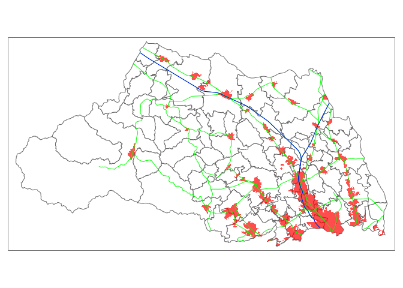
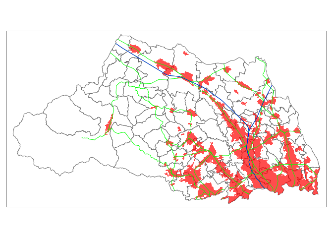

GIScience class final report
================
Takumi Abiko
2022/6/30

-   [0. 要旨](#0-要旨)
-   [1. はじめに](#1-はじめに)
    -   [1.1 背景](#11-背景)
    -   [1.2 目的](#12-目的)
-   [2. 手法](#2-手法)
-   [3. データ](#3-データ)
-   [4. 結果](#4-結果)
-   [5. 考察](#5-考察)
-   [6. 結論](#6-結論)
-   [7. Graphic Abstract](#7-graphic-abstract)
-   [8. 参考文献](#8-参考文献)

## 0. 要旨

本レポートでは、東京圏の人口増加や、東京一極集中問題に関連して、埼玉県の人口集中地区の変遷について調べる。

分析の結果、1970年から1990年にかけて埼玉県の人口集中地区が大幅に増加していることが確認できた。さらにその後も、2015年にかけて徐々に増加している。

東京圏が少子高齢化による人口減少に転じるには、まだ時間がかかると予想されているため、今後も埼玉県の人口は徐々に増加していくだろう。

   

## 1. はじめに

### 1.1 背景

近年、東京都の人口が増加している。さらには、東京一極集中問題などの問題が起きている。東京一極集中問題とは、政治、経済、文化、人口などの社会における資本。資源。活動が首都圏に集中している状況のことをいう。宮野は「東京一極集中の背景には,70年代中葉以降の日本経済の構造変化と80年代以降の世界経済の構造変化がある。」としている([宮野雄一
1994](#ref-宮野雄一1994東京一極集中と地方自治))。

また、埼玉県は東京に隣接している県であるため、埼玉に居住し、東京に通勤する人が多くいる。

### 1.2 目的

東京一極集中問題に関連して、埼玉県の年代別の人口密集地区の変遷について調べる。また、鉄道との相関についても考える。

## 2. 手法

R言語による地図データを用いた処理を利用して分析を行う。

## 3. データ

埼玉県の地図データは2021年時点でのデータを使用している。

鉄道データは2020時点年でのデータを使用している。

人口密集地区データは1970年,1990年,2005年,2015年時点でのデータを使用している。

上記データはすべて国土交通省が公開している国土数値情報ダウンロードサービスより入手した。

## 4. 結果

埼玉県の地図上に鉄道の情報と人口密集地区データを表示させた。

鉄道は在来線を緑、新幹線を青で表示している。赤く表示されている箇所が人口が密集している地区である。

1970年時点での地図を以下に示す。

<!-- -->

同様に1990年時点での地図を以下に示す。

<!-- -->

同様に2005年時点での地図を以下に示す。

<!-- -->

同様に2015年時点での地図を以下に示す。

<!-- -->

## 5. 考察

1970年時点でのデータより、県北では鉄道の沿線沿いに人口密集地区が点在していることから、鉄道の駅周辺に居住していることが読み取れる。また、県南では鉄道から少し離れた場所でも人口密集地区があることから、東京に近く通勤しやすいために、県南部に人が集中していると考えられる。

以降年代を重ねるごとに人口密集地区が増加していっていることが分かる。東京に隣接していて通勤に便利であるため、人口が増加していると考えられる。この現象は、東京一極化問題に起因する現象だといえる。

## 6. 結論

今回、東京都の人口増加に関連して、埼玉県の年代別の人口密集地区の変遷について調べた。1970年から1990年にかけて人口密集地区が、かなり増加していることが分かった。

東京一極集中問題やそれに伴う地方の少子高齢化問題など、すぐに解決できる問題ではないが今後、地道に改善されることを期待したい。

## 7. Graphic Abstract

2015年時点での地図を以下に示す。

<!-- -->

## 8. 参考文献

宮野雄一. 1994. “東京一極集中と地方自治・中間システム.” *その他 (注)* 33
(33): 33.

