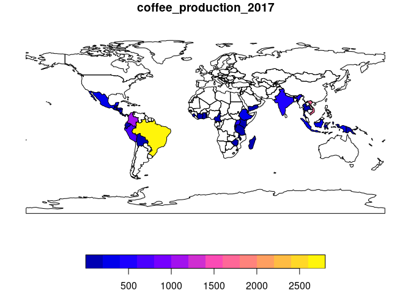
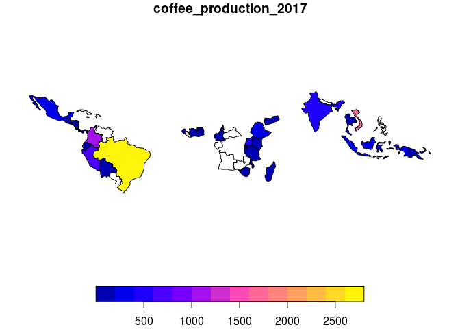
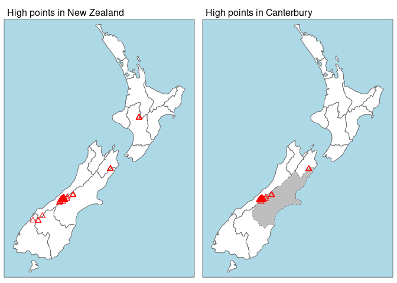
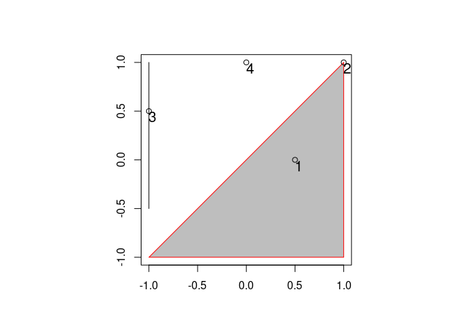
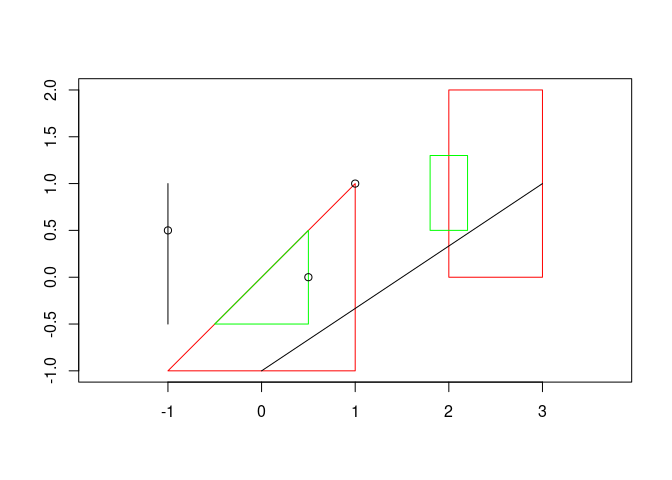

GH\_l07-08
================

``` r
##libraries
library(sf)
```

    ## Linking to GEOS 3.8.0, GDAL 3.0.4, PROJ 6.3.1

``` r
library(raster)
```

    ## Loading required package: sp

``` r
library(dplyr)
```

    ## 
    ## Attaching package: 'dplyr'

    ## The following objects are masked from 'package:raster':
    ## 
    ##     intersect, select, union

    ## The following objects are masked from 'package:stats':
    ## 
    ##     filter, lag

    ## The following objects are masked from 'package:base':
    ## 
    ##     intersect, setdiff, setequal, union

``` r
library(stringr) # for working with strings (pattern matching)
library(tidyr)   # for unite() and separate()
```

    ## 
    ## Attaching package: 'tidyr'

    ## The following object is masked from 'package:raster':
    ## 
    ##     extract

``` r
library(spData)

#worldデータとcoffee生産データを統合する
world
```

    ## Simple feature collection with 177 features and 10 fields
    ## Geometry type: MULTIPOLYGON
    ## Dimension:     XY
    ## Bounding box:  xmin: -180 ymin: -90 xmax: 180 ymax: 83.64513
    ## Geodetic CRS:  WGS 84
    ## # A tibble: 177 x 11
    ##    iso_a2 name_long continent region_un subregion type  area_km2     pop lifeExp
    ##    <chr>  <chr>     <chr>     <chr>     <chr>     <chr>    <dbl>   <dbl>   <dbl>
    ##  1 FJ     Fiji      Oceania   Oceania   Melanesia Sove…   1.93e4  8.86e5    70.0
    ##  2 TZ     Tanzania  Africa    Africa    Eastern … Sove…   9.33e5  5.22e7    64.2
    ##  3 EH     Western … Africa    Africa    Northern… Inde…   9.63e4 NA         NA  
    ##  4 CA     Canada    North Am… Americas  Northern… Sove…   1.00e7  3.55e7    82.0
    ##  5 US     United S… North Am… Americas  Northern… Coun…   9.51e6  3.19e8    78.8
    ##  6 KZ     Kazakhst… Asia      Asia      Central … Sove…   2.73e6  1.73e7    71.6
    ##  7 UZ     Uzbekist… Asia      Asia      Central … Sove…   4.61e5  3.08e7    71.0
    ##  8 PG     Papua Ne… Oceania   Oceania   Melanesia Sove…   4.65e5  7.76e6    65.2
    ##  9 ID     Indonesia Asia      Asia      South-Ea… Sove…   1.82e6  2.55e8    68.9
    ## 10 AR     Argentina South Am… Americas  South Am… Sove…   2.78e6  4.30e7    76.3
    ## # … with 167 more rows, and 2 more variables: gdpPercap <dbl>,
    ## #   geom <MULTIPOLYGON [°]>

``` r
coffee_data
```

    ## # A tibble: 47 x 3
    ##    name_long                coffee_production_2016 coffee_production_2017
    ##    <chr>                                     <int>                  <int>
    ##  1 Angola                                       NA                     NA
    ##  2 Bolivia                                       3                      4
    ##  3 Brazil                                     3277                   2786
    ##  4 Burundi                                      37                     38
    ##  5 Cameroon                                      8                      6
    ##  6 Central African Republic                     NA                     NA
    ##  7 Congo, Dem. Rep. of                           4                     12
    ##  8 Colombia                                   1330                   1169
    ##  9 Costa Rica                                   28                     32
    ## 10 Côte d'Ivoire                               114                    130
    ## # … with 37 more rows

``` r
world_coffee = left_join(world, coffee_data, by = "name_long")
class(world_coffee)
```

    ## [1] "sf"         "tbl_df"     "tbl"        "data.frame"

``` r
world_coffee
```

    ## Simple feature collection with 177 features and 12 fields
    ## Geometry type: MULTIPOLYGON
    ## Dimension:     XY
    ## Bounding box:  xmin: -180 ymin: -90 xmax: 180 ymax: 83.64513
    ## Geodetic CRS:  WGS 84
    ## # A tibble: 177 x 13
    ##    iso_a2 name_long continent region_un subregion type  area_km2     pop lifeExp
    ##    <chr>  <chr>     <chr>     <chr>     <chr>     <chr>    <dbl>   <dbl>   <dbl>
    ##  1 FJ     Fiji      Oceania   Oceania   Melanesia Sove…   1.93e4  8.86e5    70.0
    ##  2 TZ     Tanzania  Africa    Africa    Eastern … Sove…   9.33e5  5.22e7    64.2
    ##  3 EH     Western … Africa    Africa    Northern… Inde…   9.63e4 NA         NA  
    ##  4 CA     Canada    North Am… Americas  Northern… Sove…   1.00e7  3.55e7    82.0
    ##  5 US     United S… North Am… Americas  Northern… Coun…   9.51e6  3.19e8    78.8
    ##  6 KZ     Kazakhst… Asia      Asia      Central … Sove…   2.73e6  1.73e7    71.6
    ##  7 UZ     Uzbekist… Asia      Asia      Central … Sove…   4.61e5  3.08e7    71.0
    ##  8 PG     Papua Ne… Oceania   Oceania   Melanesia Sove…   4.65e5  7.76e6    65.2
    ##  9 ID     Indonesia Asia      Asia      South-Ea… Sove…   1.82e6  2.55e8    68.9
    ## 10 AR     Argentina South Am… Americas  South Am… Sove…   2.78e6  4.30e7    76.3
    ## # … with 167 more rows, and 4 more variables: gdpPercap <dbl>,
    ## #   geom <MULTIPOLYGON [°]>, coffee_production_2016 <int>,
    ## #   coffee_production_2017 <int>

``` r
plot(world_coffee["coffee_production_2017"])
```

<!-- -->

``` r
world_coffee_inner <- inner_join(world, coffee_data)
```

    ## Joining, by = "name_long"

``` r
world_coffee_inner
```

    ## Simple feature collection with 45 features and 12 fields
    ## Geometry type: MULTIPOLYGON
    ## Dimension:     XY
    ## Bounding box:  xmin: -117.1278 ymin: -33.76838 xmax: 156.02 ymax: 35.49401
    ## Geodetic CRS:  WGS 84
    ## # A tibble: 45 x 13
    ##    iso_a2 name_long  continent region_un subregion type  area_km2    pop lifeExp
    ##    <chr>  <chr>      <chr>     <chr>     <chr>     <chr>    <dbl>  <dbl>   <dbl>
    ##  1 TZ     Tanzania   Africa    Africa    Eastern … Sove…  932746. 5.22e7    64.2
    ##  2 PG     Papua New… Oceania   Oceania   Melanesia Sove…  464520. 7.76e6    65.2
    ##  3 ID     Indonesia  Asia      Asia      South-Ea… Sove… 1819251. 2.55e8    68.9
    ##  4 KE     Kenya      Africa    Africa    Eastern … Sove…  590837. 4.60e7    66.2
    ##  5 DO     Dominican… North Am… Americas  Caribbean Sove…   48158. 1.04e7    73.5
    ##  6 TL     Timor-Les… Asia      Asia      South-Ea… Sove…   14715. 1.21e6    68.3
    ##  7 MX     Mexico     North Am… Americas  Central … Sove… 1969480. 1.24e8    76.8
    ##  8 BR     Brazil     South Am… Americas  South Am… Sove… 8508557. 2.04e8    75.0
    ##  9 BO     Bolivia    South Am… Americas  South Am… Sove… 1085270. 1.06e7    68.4
    ## 10 PE     Peru       South Am… Americas  South Am… Sove… 1309700. 3.10e7    74.5
    ## # … with 35 more rows, and 4 more variables: gdpPercap <dbl>,
    ## #   geom <MULTIPOLYGON [°]>, coffee_production_2016 <int>,
    ## #   coffee_production_2017 <int>

``` r
plot(world_coffee_inner["coffee_production_2017"])
```

<!-- -->

``` r
world_new = world # do not overwrite our original data
world_new$pop_dens = world_new$pop / world_new$area_km2
world_new
```

    ## Simple feature collection with 177 features and 11 fields
    ## Geometry type: MULTIPOLYGON
    ## Dimension:     XY
    ## Bounding box:  xmin: -180 ymin: -90 xmax: 180 ymax: 83.64513
    ## Geodetic CRS:  WGS 84
    ## # A tibble: 177 x 12
    ##    iso_a2 name_long continent region_un subregion type  area_km2     pop lifeExp
    ##  * <chr>  <chr>     <chr>     <chr>     <chr>     <chr>    <dbl>   <dbl>   <dbl>
    ##  1 FJ     Fiji      Oceania   Oceania   Melanesia Sove…   1.93e4  8.86e5    70.0
    ##  2 TZ     Tanzania  Africa    Africa    Eastern … Sove…   9.33e5  5.22e7    64.2
    ##  3 EH     Western … Africa    Africa    Northern… Inde…   9.63e4 NA         NA  
    ##  4 CA     Canada    North Am… Americas  Northern… Sove…   1.00e7  3.55e7    82.0
    ##  5 US     United S… North Am… Americas  Northern… Coun…   9.51e6  3.19e8    78.8
    ##  6 KZ     Kazakhst… Asia      Asia      Central … Sove…   2.73e6  1.73e7    71.6
    ##  7 UZ     Uzbekist… Asia      Asia      Central … Sove…   4.61e5  3.08e7    71.0
    ##  8 PG     Papua Ne… Oceania   Oceania   Melanesia Sove…   4.65e5  7.76e6    65.2
    ##  9 ID     Indonesia Asia      Asia      South-Ea… Sove…   1.82e6  2.55e8    68.9
    ## 10 AR     Argentina South Am… Americas  South Am… Sove…   2.78e6  4.30e7    76.3
    ## # … with 167 more rows, and 3 more variables: gdpPercap <dbl>,
    ## #   geom <MULTIPOLYGON [°]>, pop_dens <dbl>

``` r
world_new2 <- world %>% mutate(pop_dens = pop/area_km2)

world %>% transmute(pop_dens = pop/area_km2)
```

    ## Simple feature collection with 177 features and 1 field
    ## Geometry type: MULTIPOLYGON
    ## Dimension:     XY
    ## Bounding box:  xmin: -180 ymin: -90 xmax: 180 ymax: 83.64513
    ## Geodetic CRS:  WGS 84
    ## # A tibble: 177 x 2
    ##    pop_dens                                                                 geom
    ##  *    <dbl>                                                   <MULTIPOLYGON [°]>
    ##  1    45.9  (((180 -16.06713, 180 -16.55522, 179.3641 -16.80135, 178.7251 -17.0…
    ##  2    56.0  (((33.90371 -0.95, 34.07262 -1.05982, 37.69869 -3.09699, 37.7669 -3…
    ##  3    NA    (((-8.66559 27.65643, -8.665124 27.58948, -8.6844 27.39574, -8.6872…
    ##  4     3.54 (((-122.84 49, -122.9742 49.00254, -124.9102 49.98456, -125.6246 50…
    ##  5    33.5  (((-122.84 49, -120 49, -117.0312 49, -116.0482 49, -113 49, -110.0…
    ##  6     6.33 (((87.35997 49.21498, 86.59878 48.54918, 85.76823 48.45575, 85.7204…
    ##  7    66.7  (((55.96819 41.30864, 55.92892 44.99586, 58.50313 45.5868, 58.68999…
    ##  8    16.7  (((141.0002 -2.600151, 142.7352 -3.289153, 144.584 -3.861418, 145.2…
    ##  9   140.   (((141.0002 -2.600151, 141.0171 -5.859022, 141.0339 -9.117893, 140.…
    ## 10    15.4  (((-68.63401 -52.63637, -68.25 -53.1, -67.75 -53.85, -66.45 -54.45,…
    ## # … with 167 more rows

``` r
world %>% transmute(pop_dens = pop/area_km2) %>% st_drop_geometry()
```

    ## # A tibble: 177 x 1
    ##    pop_dens
    ##  *    <dbl>
    ##  1    45.9 
    ##  2    56.0 
    ##  3    NA   
    ##  4     3.54
    ##  5    33.5 
    ##  6     6.33
    ##  7    66.7 
    ##  8    16.7 
    ##  9   140.  
    ## 10    15.4 
    ## # … with 167 more rows

``` r
elev = raster(nrows = 6, ncols = 6, res = 0.5,
              xmn = -1.5, xmx = 1.5, ymn = -1.5, ymx = 1.5,
              vals = 1:36)

# row 1, column 1
elev[1, 1]
```

    ## [1] 1

``` r
# cell ID 1
elev[1]
```

    ## [1] 1

``` r
elev[1, 1] = 0
elev[]
```

    ##  [1]  0  2  3  4  5  6  7  8  9 10 11 12 13 14 15 16 17 18 19 20 21 22 23 24 25
    ## [26] 26 27 28 29 30 31 32 33 34 35 36

``` r
#mapに表示させる
canterbury = nz %>% filter(Name == "Canterbury")
canterbury_height = nz_height[canterbury, ]

library(tmap)
p_hpnz1 = tm_shape(nz) + tm_polygons(col = "white") +
  tm_shape(nz_height) + tm_symbols(shape = 2, col = "red", size = 0.25) +
  tm_layout(main.title = "High points in New Zealand", main.title.size = 1,
            bg.color = "lightblue")
p_hpnz2 = tm_shape(nz) + tm_polygons(col = "white") +
  tm_shape(canterbury) + tm_fill(col = "gray") + 
  tm_shape(canterbury_height) + tm_symbols(shape = 2, col = "red", size = 0.25) +
  tm_layout(main.title = "High points in Canterbury", main.title.size = 1,
            bg.color = "lightblue")
tmap_arrange(p_hpnz1, p_hpnz2, ncol = 2)
```

<!-- -->

``` r
# create a polygon
a_poly = st_polygon(list(rbind(c(-1, -1), c(1, -1), c(1, 1), c(-1, -1))))
a = st_sfc(a_poly)
# create a line
l_line = st_linestring(x = matrix(c(-1, -1, -0.5, 1), ncol = 2))
l = st_sfc(l_line)
# create points
p_matrix = matrix(c(0.5, 1, -1, 0, 0, 1, 0.5, 1), ncol = 2)
p_multi = st_multipoint(x = p_matrix)
p = st_cast(st_sfc(p_multi), "POINT")

par(pty = "s")
plot(a, border = "red", col = "gray", axes = TRUE)
plot(l, add = TRUE)
plot(p, add = TRUE, lab = 1:4)
text(p_matrix[, 1] + 0.04, p_matrix[, 2] - 0.06, 1:4, cex = 1.3)
```

<!-- -->

``` r
st_intersects(p, a)
```

    ## Sparse geometry binary predicate list of length 4, where the predicate was `intersects'
    ##  1: 1
    ##  2: 1
    ##  3: (empty)
    ##  4: (empty)

``` r
#> Sparse geometry binary ..., where the predicate was `intersects'
#> 1: 1
#> 2: 1
#> 3: (empty)
#> 4: (empty)

#
st_intersects(p, a, sparse = FALSE)
```

    ##       [,1]
    ## [1,]  TRUE
    ## [2,]  TRUE
    ## [3,] FALSE
    ## [4,] FALSE

``` r
#
st_disjoint(p, a, sparse = FALSE)[, 1]
```

    ## [1] FALSE FALSE  TRUE  TRUE

``` r
#中にあるか
st_within(p, a, sparse = FALSE)[, 1]
```

    ## [1]  TRUE FALSE FALSE FALSE

``` r
#触れているか
st_touches(p, a, sparse = FALSE)[, 1]
```

    ## [1] FALSE  TRUE FALSE FALSE

``` r
sel = st_is_within_distance(p, a, dist = 0.9) # can only return a sparse matrix
lengths(sel) > 0
```

    ## [1]  TRUE  TRUE FALSE  TRUE

``` r
st_overlaps(p, a, sparse = FALSE)
```

    ##       [,1]
    ## [1,] FALSE
    ## [2,] FALSE
    ## [3,] FALSE
    ## [4,] FALSE

``` r
st_covers(p, a, sparse = FALSE)
```

    ##       [,1]
    ## [1,] FALSE
    ## [2,] FALSE
    ## [3,] FALSE
    ## [4,] FALSE

``` r
st_covered_by(p, a, sparse = FALSE)
```

    ##       [,1]
    ## [1,]  TRUE
    ## [2,]  TRUE
    ## [3,] FALSE
    ## [4,] FALSE

``` r
st_contains(a, p[2, ], sparse = TRUE)
```

    ## Sparse geometry binary predicate list of length 1, where the predicate was `contains'
    ##  1: (empty)

``` r
# starting simpler so commented
a1 = st_polygon(list(rbind(c(-1, -1), c(1, -1), c(1, 1), c(-1, -1))))
a2 = st_polygon(list(rbind(c(2, 0), c(2, 2), c(3, 2), c(3, 0), c(2, 0))))
a = st_sfc(a1, a2)

b1 = a1 * 0.5
b2 = a2 * 0.4 + c(1, 0.5)
b = st_sfc(b1, b2)

l1 = st_linestring(x = matrix(c(0, 3, -1, 1), , 2))
l2 = st_linestring(x = matrix(c(-1, -1, -0.5, 1), , 2))
l = st_sfc(l1, l2)

p = st_multipoint(x = matrix(c(0.5, 1, -1, 0, 1, 0.5), , 2))

plot(a, border = "red", axes = TRUE)
plot(b, border = "green", add = TRUE)
plot(l, add = TRUE)
plot(p, add = TRUE)
```

<!-- -->

``` r
set.seed(2018) # set seed for reproducibility
(bb_world = st_bbox(world)) # the world's bounds
```

    ##       xmin       ymin       xmax       ymax 
    ## -180.00000  -90.00000  180.00000   83.64513

``` r
random_df = tibble(
  x = runif(n = 10, min = bb_world[1], max = bb_world[3]),
  y = runif(n = 10, min = bb_world[2], max = bb_world[4])
)
random_points = random_df %>% 
  st_as_sf(coords = c("x", "y")) %>% # set coordinates
  st_set_crs(4326) # set geographic CRS

world_random = world[random_points, ]
```

    ## although coordinates are longitude/latitude, st_intersects assumes that they are planar

``` r
nrow(world_random)
```

    ## [1] 4

``` r
random_joined = st_join(random_points, world["name_long"])
```

    ## although coordinates are longitude/latitude, st_intersects assumes that they are planar
    ## although coordinates are longitude/latitude, st_intersects assumes that they are planar

``` r
#source("./code/04-spatial-join.R")

#tmap_arrange(jm1, jm2, jm3, jm4, nrow = 2, ncol = 2)

#plot(st_geometry(cycle_hire), col = "blue")
#plot(st_geometry(cycle_hire_osm), add = TRUE, pch = 3, col = "red")

#any(st_touches(cycle_hire, cycle_hire_osm, sparse = FALSE))

#sum(st_geometry(cycle_hire) %in% st_geometry(cycle_hire_osm))
#sum(st_coordinates(cycle_hire)[, 1] %in% st_coordinates(cycle_hire_osm)[, 1])
```
