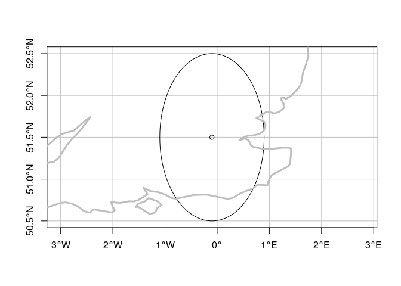
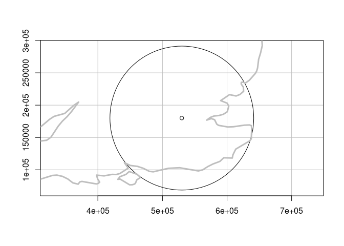
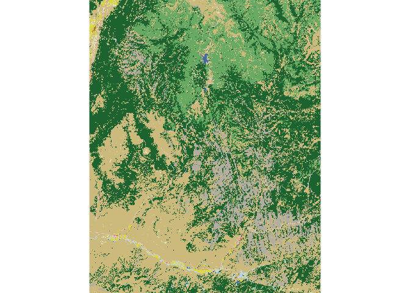
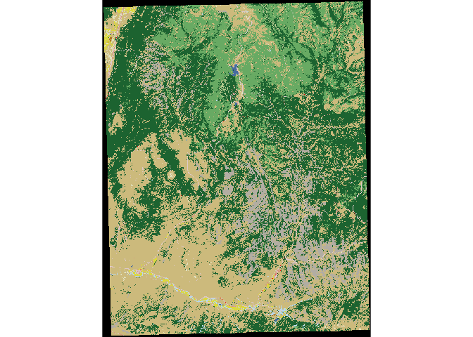
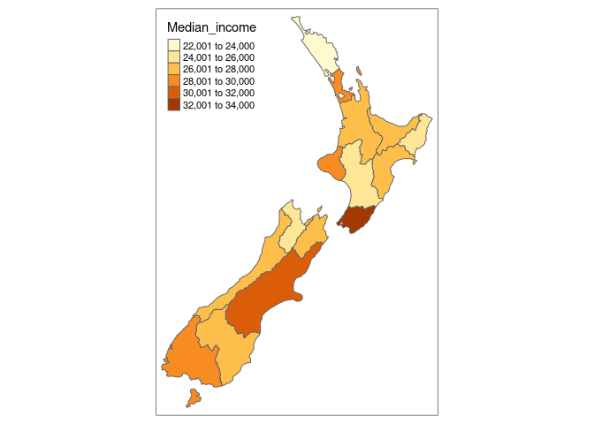
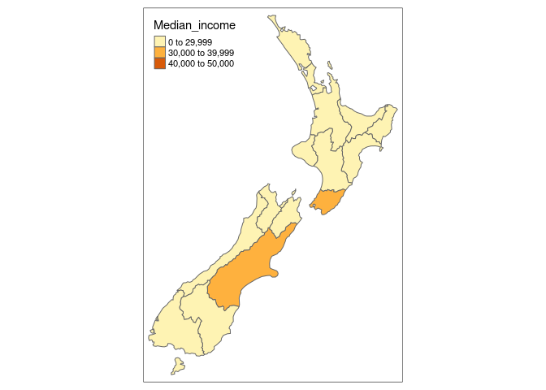
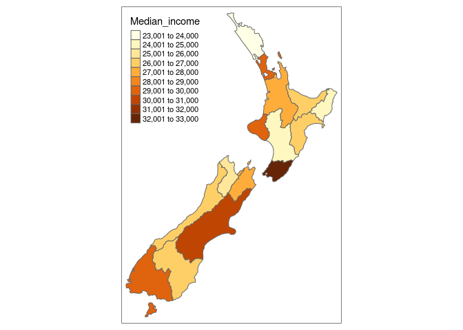
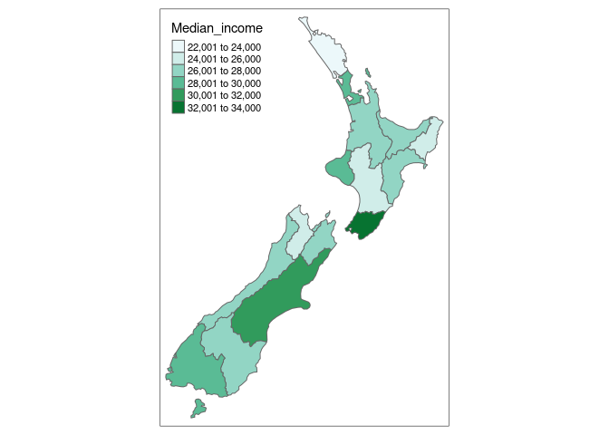
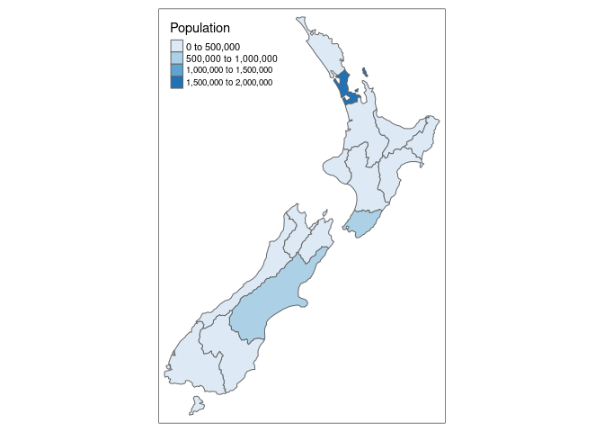
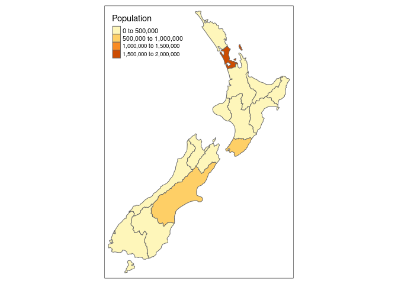

l09-10
================

``` r
library(sf)
```

    ## Linking to GEOS 3.8.0, GDAL 3.0.4, PROJ 6.3.1

``` r
library(raster)
```

    ## Loading required package: sp

``` r
library(dplyr)
```

    ## 
    ## Attaching package: 'dplyr'

    ## The following objects are masked from 'package:raster':
    ## 
    ##     intersect, select, union

    ## The following objects are masked from 'package:stats':
    ## 
    ##     filter, lag

    ## The following objects are masked from 'package:base':
    ## 
    ##     intersect, setdiff, setequal, union

``` r
library(spData)
library(spDataLarge)

library(tmap)    # for static and interactive maps
library(leaflet) # for interactive maps
library(ggplot2) # tidyverse data visualization package
```

``` r
london = data.frame(lon = -0.1, lat = 51.5) %>% 
  st_as_sf(coords = c("lon", "lat"))
st_is_longlat(london)
```

    ## [1] NA

``` r
london_geo = st_set_crs(london, 4326)
st_is_longlat(london_geo)
```

    ## [1] TRUE

``` r
#st_bufferのバッファーが正しくないと警告される
#緯度経度のバッファー
london_buff_no_crs = st_buffer(london, dist = 1)
london_buff = st_buffer(london_geo, dist = 1)
```

    ## Warning in st_buffer.sfc(st_geometry(x), dist, nQuadSegs, endCapStyle =
    ## endCapStyle, : st_buffer does not correctly buffer longitude/latitude data

    ## dist is assumed to be in decimal degrees (arc_degrees).

``` r
#実行するだけでlondon_projが定義される
london_proj = data.frame(x = 530000, y = 180000) %>% 
  st_as_sf(coords = 1:2, crs = 27700)

#st_crsで中身を確認できる
st_crs(london_proj)
```

    ## Coordinate Reference System:
    ##   User input: EPSG:27700 
    ##   wkt:
    ## PROJCRS["OSGB 1936 / British National Grid",
    ##     BASEGEOGCRS["OSGB 1936",
    ##         DATUM["OSGB 1936",
    ##             ELLIPSOID["Airy 1830",6377563.396,299.3249646,
    ##                 LENGTHUNIT["metre",1]]],
    ##         PRIMEM["Greenwich",0,
    ##             ANGLEUNIT["degree",0.0174532925199433]],
    ##         ID["EPSG",4277]],
    ##     CONVERSION["British National Grid",
    ##         METHOD["Transverse Mercator",
    ##             ID["EPSG",9807]],
    ##         PARAMETER["Latitude of natural origin",49,
    ##             ANGLEUNIT["degree",0.0174532925199433],
    ##             ID["EPSG",8801]],
    ##         PARAMETER["Longitude of natural origin",-2,
    ##             ANGLEUNIT["degree",0.0174532925199433],
    ##             ID["EPSG",8802]],
    ##         PARAMETER["Scale factor at natural origin",0.9996012717,
    ##             SCALEUNIT["unity",1],
    ##             ID["EPSG",8805]],
    ##         PARAMETER["False easting",400000,
    ##             LENGTHUNIT["metre",1],
    ##             ID["EPSG",8806]],
    ##         PARAMETER["False northing",-100000,
    ##             LENGTHUNIT["metre",1],
    ##             ID["EPSG",8807]]],
    ##     CS[Cartesian,2],
    ##         AXIS["(E)",east,
    ##             ORDER[1],
    ##             LENGTHUNIT["metre",1]],
    ##         AXIS["(N)",north,
    ##             ORDER[2],
    ##             LENGTHUNIT["metre",1]],
    ##     USAGE[
    ##         SCOPE["unknown"],
    ##         AREA["UK - Britain and UKCS 49°46'N to 61°01'N, 7°33'W to 3°33'E"],
    ##         BBOX[49.75,-9.2,61.14,2.88]],
    ##     ID["EPSG",27700]]

``` r
#> Coordinate Reference System:
#>   EPSG: 27700 
#>   proj4string: "+proj=tmerc +lat_0=49 +lon_0=-2 ... +units=m +no_defs"

#1°換算で113kmになる(直交座標系)
london_proj_buff = st_buffer(london_proj, 111320)
```

``` r
uk = rnaturalearth::ne_countries(scale = 50) %>% 
  st_as_sf() %>% 
  filter(grepl(pattern = "United Kingdom|Ire", x = name_long))
plot(london_buff, graticule = st_crs(4326), axes = TRUE, reset = FALSE)
plot(london_geo, add = TRUE)
plot(st_geometry(uk), add = TRUE, border = "gray", lwd = 3)
```

<!-- -->

``` r
#st_transformで座標系を変換することができる
uk_proj = uk %>%
  st_transform(27700)
plot(london_proj_buff, graticule = st_crs(27700), axes = TRUE, reset = FALSE)
plot(london_proj, add = TRUE)
plot(st_geometry(uk_proj), add = TRUE, border = "gray", lwd = 3)
```

<!-- -->

``` r
#直交座標系の方が綺麗に見える
```

``` r
#lonlat2UTM関数の定義
lonlat2UTM = function(lonlat) {
  utm = (floor((lonlat[1] + 180) / 6) %% 60) + 1
  if(lonlat[2] > 0) {
    utm + 32600
  } else{
    utm + 32700
  }
}

stplanr::geo_code("Auckland")
```

    ## [1] 174.76318 -36.85209

``` r
epsg_utm_auk = lonlat2UTM(c(174.7, -36.9))
epsg_utm_lnd = lonlat2UTM(st_coordinates(london))
st_crs(epsg_utm_auk)$proj4string
```

    ## [1] "+proj=utm +zone=60 +south +datum=WGS84 +units=m +no_defs"

``` r
st_crs(epsg_utm_lnd)$proj4string
```

    ## [1] "+proj=utm +zone=30 +datum=WGS84 +units=m +no_defs"

``` {r　chapter6.4}
crs_lnd = st_crs(cycle_hire_osm)
class(crs_lnd)
crs_lnd$epsg

#projectionとそれに対応するコードが見れる
crs_codes = rgdal::make_EPSG()[1:2]
dplyr::filter(crs_codes, code == 27700)
```

``` {r　chapter6.5}
world_mollweide = st_transform(world, crs = "+proj=moll")
plot(world_mollweide$geom)
plot(world_mollweide$geom, graticule = TRUE)

world_wintri = lwgeom::st_transform_proj(world, crs = "+proj=wintri")

world_laea1 = st_transform(world, 
                           crs = "+proj=laea +x_0=0 +y_0=0 +lon_0=0 +lat_0=0")

untibble = function(x) structure(x, class = setdiff(class(x), c("tbl_df", "tbl")))

world_laea1_g = st_graticule(ndiscr = 10000) %>%
  st_transform("+proj=laea +x_0=0 +y_0=0 +lon_0=0 +lat_0=0") %>% 
  st_geometry() %>% untibble()
valid_geometries = st_is_valid(world_laea1) # some geometries not valid
# world_laea1_valid = lwgeom::st_make_valid(world_laea1) # doesn't solve it
# world_laea1_subset = world_laea1[valid_geometries, ] # solves it but removes countries
world_laea1_lines = st_cast(world_laea1, "MULTILINESTRING") %>% untibble()

tm_shape(world_laea1_g) + tm_lines(col = "gray") +
  # tm_shape(world_laea1) + tm_borders(col = "black")
  tm_shape(world_laea1_lines) + tm_lines(col = "black")
```

``` r
cat_raster = raster(system.file("raster/nlcd2011.tif", package = "spDataLarge"))
```

    ## Warning in showSRID(uprojargs, format = "PROJ", multiline = "NO", prefer_proj
    ## = prefer_proj): Discarded datum Unknown based on GRS80 ellipsoid in Proj4
    ## definition

``` r
crs(cat_raster)
```

    ## CRS arguments:
    ##  +proj=utm +zone=12 +ellps=GRS80 +units=m +no_defs

``` r
plot(cat_raster)
```

<!-- --><!-- -->

``` r
unique(cat_raster)
```

    ##  [1] 11 21 22 23 31 41 42 43 52 71 81 82 90 95

``` r
wgs84 = "+proj=longlat +ellps=WGS84 +datum=WGS84 +no_defs"
cat_raster_wgs84 = projectRaster(cat_raster, crs = wgs84, method = "ngb")

tibble(
  CRS = c("NAD83", "WGS84"),
  nrow = c(nrow(cat_raster), nrow(cat_raster_wgs84)),
  ncol = c(ncol(cat_raster), ncol(cat_raster_wgs84)),
  ncell = c(ncell(cat_raster), ncell(cat_raster_wgs84)),
  resolution = c(mean(res(cat_raster)), mean(res(cat_raster_wgs84),
                                             na.rm = TRUE)),
  unique_categories = c(length(unique(values(cat_raster))),
                        length(unique(values(cat_raster_wgs84))))) %>%
  knitr::kable(caption = paste("Key attributes in the original ('cat\\_raster')", 
                               "and projected ('cat\\_raster\\_wgs84')", 
                               "categorical raster datasets."),
               caption.short = paste("Key attributes in the original and", 
                                     "projected raster datasets"),
               digits = 4, booktabs = TRUE)
```

| CRS   | nrow | ncol |   ncell | resolution | unique\_categories |
|:------|-----:|-----:|--------:|-----------:|-------------------:|
| NAD83 | 1359 | 1073 | 1458207 |    31.5275 |                 14 |
| WGS84 | 1394 | 1111 | 1548734 |     0.0003 |                 15 |

Key attributes in the original (‘cat\_raster’) and projected
(‘cat\_raster\_wgs84’) categorical raster datasets.

``` r
plot(cat_raster_wgs84)
```

<!-- --><!-- -->

``` r
#座標を置き換えることができない場合はNAになるためカテゴリ数が14から15に増える
```

``` r
#ベクターデータはst_read関数で読み込める
#ラスターデータはraster関数で読み込む
#urlは古いため機能しない
#download.file(url = "http://nrdata.nps.gov/programs/lands/nps_boundary.zip",
#              destfile = "nps_boundary.zip")
#unzip(zipfile = "nps_boundary.zip")
#usa_parks = st_read(dsn = "nps_boundary.shp")
```

``` r
library(rnaturalearth)
usa = ne_countries(country = "United States of America") # United States borders
class(usa)
```

    ## [1] "SpatialPolygonsDataFrame"
    ## attr(,"package")
    ## [1] "sp"

``` r
# alternative way of accessing the data, with raster::getData()
# getData("GADM", country = "USA", level = 0)

usa_sf = st_as_sf(usa)

library(osmdata)
```

    ## Data (c) OpenStreetMap contributors, ODbL 1.0. https://www.openstreetmap.org/copyright

``` r
parks = opq(bbox = "leeds uk") %>% 
  add_osm_feature(key = "leisure", value = "park") %>% 
  osmdata_sf()
```

\#?vignette(‘osmdata’)

``` r
file_formats = tibble::tribble(~Name, ~Extension, ~Info, ~Type, ~Model, 
                         "ESRI Shapefile", ".shp (the main file)", "Popular format consisting of at least three files. No support for: files > 2GB;  mixed types; names > 10 chars; cols > 255.", "Vector", "Partially open",
                         "GeoJSON", ".geojson", "Extends the JSON exchange format by including a subset of the simple feature representation.", "Vector", "Open",
                         "KML", ".kml", "XML-based format for spatial visualization, developed for use with Google Earth. Zipped KML file forms the KMZ format.", "Vector", "Open",
                         "GPX", ".gpx", "XML schema created for exchange of GPS data.", "Vector", "Open",
                         "GeoTIFF", ".tif/.tiff", "Popular raster format. A TIFF file containing additional spatial metadata.", "Raster", "Open",
                         "Arc ASCII", ".asc", "Text format where the first six lines represent the raster header, followed by the raster cell values arranged in rows and columns.", "Raster", "Open",
                         "R-raster", ".gri, .grd", "Native raster format of the R-package raster.", "Raster", "Open",
                         "SQLite/SpatiaLite", ".sqlite", "Standalone  relational database, SpatiaLite is the spatial extension of SQLite.", "Vector and raster", "Open",
                         "ESRI FileGDB", ".gdb", "Spatial and nonspatial objects created by ArcGIS. Allows: multiple feature classes; topology. Limited support from GDAL.", "Vector and raster", "Proprietary",
                         "GeoPackage", ".gpkg", "Lightweight database container based on SQLite allowing an easy and platform-independent exchange of geodata", "Vector and raster", "Open"
                         )
knitr::kable(file_formats, 
             caption = "Selected spatial file formats.",
             caption.short = "Selected spatial file formats.",
             booktabs = TRUE) %>% 
  kableExtra::column_spec(2, width = "7em") %>% 
  kableExtra::column_spec(3, width = "14em") %>% 
  kableExtra::column_spec(5, width = "7em")
```

<table>
<caption>
Selected spatial file formats.
</caption>
<thead>
<tr>
<th style="text-align:left;">
Name
</th>
<th style="text-align:left;">
Extension
</th>
<th style="text-align:left;">
Info
</th>
<th style="text-align:left;">
Type
</th>
<th style="text-align:left;">
Model
</th>
</tr>
</thead>
<tbody>
<tr>
<td style="text-align:left;">
ESRI Shapefile
</td>
<td style="text-align:left;width: 7em; ">
.shp (the main file)
</td>
<td style="text-align:left;width: 14em; ">
Popular format consisting of at least three files. No support for: files
&gt; 2GB; mixed types; names &gt; 10 chars; cols &gt; 255.
</td>
<td style="text-align:left;">
Vector
</td>
<td style="text-align:left;width: 7em; ">
Partially open
</td>
</tr>
<tr>
<td style="text-align:left;">
GeoJSON
</td>
<td style="text-align:left;width: 7em; ">
.geojson
</td>
<td style="text-align:left;width: 14em; ">
Extends the JSON exchange format by including a subset of the simple
feature representation.
</td>
<td style="text-align:left;">
Vector
</td>
<td style="text-align:left;width: 7em; ">
Open
</td>
</tr>
<tr>
<td style="text-align:left;">
KML
</td>
<td style="text-align:left;width: 7em; ">
.kml
</td>
<td style="text-align:left;width: 14em; ">
XML-based format for spatial visualization, developed for use with
Google Earth. Zipped KML file forms the KMZ format.
</td>
<td style="text-align:left;">
Vector
</td>
<td style="text-align:left;width: 7em; ">
Open
</td>
</tr>
<tr>
<td style="text-align:left;">
GPX
</td>
<td style="text-align:left;width: 7em; ">
.gpx
</td>
<td style="text-align:left;width: 14em; ">
XML schema created for exchange of GPS data.
</td>
<td style="text-align:left;">
Vector
</td>
<td style="text-align:left;width: 7em; ">
Open
</td>
</tr>
<tr>
<td style="text-align:left;">
GeoTIFF
</td>
<td style="text-align:left;width: 7em; ">
.tif/.tiff
</td>
<td style="text-align:left;width: 14em; ">
Popular raster format. A TIFF file containing additional spatial
metadata.
</td>
<td style="text-align:left;">
Raster
</td>
<td style="text-align:left;width: 7em; ">
Open
</td>
</tr>
<tr>
<td style="text-align:left;">
Arc ASCII
</td>
<td style="text-align:left;width: 7em; ">
.asc
</td>
<td style="text-align:left;width: 14em; ">
Text format where the first six lines represent the raster header,
followed by the raster cell values arranged in rows and columns.
</td>
<td style="text-align:left;">
Raster
</td>
<td style="text-align:left;width: 7em; ">
Open
</td>
</tr>
<tr>
<td style="text-align:left;">
R-raster
</td>
<td style="text-align:left;width: 7em; ">
.gri, .grd
</td>
<td style="text-align:left;width: 14em; ">
Native raster format of the R-package raster.
</td>
<td style="text-align:left;">
Raster
</td>
<td style="text-align:left;width: 7em; ">
Open
</td>
</tr>
<tr>
<td style="text-align:left;">
SQLite/SpatiaLite
</td>
<td style="text-align:left;width: 7em; ">
.sqlite
</td>
<td style="text-align:left;width: 14em; ">
Standalone relational database, SpatiaLite is the spatial extension of
SQLite.
</td>
<td style="text-align:left;">
Vector and raster
</td>
<td style="text-align:left;width: 7em; ">
Open
</td>
</tr>
<tr>
<td style="text-align:left;">
ESRI FileGDB
</td>
<td style="text-align:left;width: 7em; ">
.gdb
</td>
<td style="text-align:left;width: 14em; ">
Spatial and nonspatial objects created by ArcGIS. Allows: multiple
feature classes; topology. Limited support from GDAL.
</td>
<td style="text-align:left;">
Vector and raster
</td>
<td style="text-align:left;width: 7em; ">
Proprietary
</td>
</tr>
<tr>
<td style="text-align:left;">
GeoPackage
</td>
<td style="text-align:left;width: 7em; ">
.gpkg
</td>
<td style="text-align:left;width: 14em; ">
Lightweight database container based on SQLite allowing an easy and
platform-independent exchange of geodata
</td>
<td style="text-align:left;">
Vector and raster
</td>
<td style="text-align:left;width: 7em; ">
Open
</td>
</tr>
</tbody>
</table>

``` r
vector_filepath = system.file("shapes/world.gpkg", package = "spData")
world = st_read(vector_filepath)
```

    ## Reading layer `world' from data source `/usr/local/lib/R/site-library/spData/shapes/world.gpkg' using driver `GPKG'
    ## Simple feature collection with 177 features and 10 fields
    ## Geometry type: MULTIPOLYGON
    ## Dimension:     XY
    ## Bounding box:  xmin: -180 ymin: -90 xmax: 180 ymax: 83.64513
    ## Geodetic CRS:  WGS 84

``` r
#> Reading layer `world' from data source `.../world.gpkg' using driver `GPKG'
#> Simple feature collection with 177 features and 10 fields
#> geometry type:  MULTIPOLYGON
#> dimension:      XY
#> bbox:           xmin: -180 ymin: -90 xmax: 180 ymax: 83.64513
#> epsg (SRID):    4326
#> proj4string:    +proj=longlat +datum=WGS84 +no_defs

cycle_hire_txt = system.file("misc/cycle_hire_xy.csv", package = "spData")
cycle_hire_xy = st_read(cycle_hire_txt, options = c("X_POSSIBLE_NAMES=X",
                                                    "Y_POSSIBLE_NAMES=Y"))
```

    ## options:        X_POSSIBLE_NAMES=X Y_POSSIBLE_NAMES=Y 
    ## Reading layer `cycle_hire_xy' from data source `/usr/local/lib/R/site-library/spData/misc/cycle_hire_xy.csv' using driver `CSV'
    ## Simple feature collection with 742 features and 7 fields
    ## Geometry type: POINT
    ## Dimension:     XY
    ## Bounding box:  xmin: -0.2367699 ymin: 51.45475 xmax: -0.002275 ymax: 51.54214
    ## CRS:           NA

``` r
world_txt = system.file("misc/world_wkt.csv", package = "spData")
world_wkt = read_sf(world_txt, options = "GEOM_POSSIBLE_NAMES=WKT")
# the same as
world_wkt = st_read(world_txt, options = "GEOM_POSSIBLE_NAMES=WKT", 
                    quiet = TRUE, stringsAsFactors = FALSE, as_tibble = TRUE)
```

``` r
raster_filepath = system.file("raster/srtm.tif", package = "spDataLarge")
single_layer = raster(raster_filepath)

multilayer_filepath = system.file("raster/landsat.tif", package = "spDataLarge")
band3 = raster(multilayer_filepath, band = 3)

#brickはメモリに全て載せる
#stackはポインタだけをメモリに載せる
multilayer_brick = brick(multilayer_filepath)
multilayer_stack = stack(multilayer_filepath)
```

``` r
#ファイルに書き出す(指定したファイル名がすでに存在するとエラーを吐く)
#st_write(obj = world, dsn = "world.shp")
```

``` r
dT = tibble::tribble(
               ~`Data type`,      ~`Minimum value`,        ~`Maximum value`,
               "LOG1S",             "FALSE (0)",              "TRUE (1)",
               "INT1S",                  "-127",                   "127",
               "INT1U",                     "0",                   "255",
               "INT2S",               "-32,767",                "32,767",
               "INT2U",                     "0",                "65,534",
               "INT4S",        "-2,147,483,647",         "2,147,483,647",
               "INT4U",                     "0",         "4,294,967,296",
               "FLT4S",              "-3.4e+38",               "3.4e+38",
               "FLT8S",             "-1.7e+308",              "1.7e+308"
  )
knitr::kable(dT, caption = "Data types supported by the raster package.",
             caption.short = "Data types supported by the raster package.",
             booktabs = TRUE)
```

<table>
<caption>
Data types supported by the raster package.
</caption>
<thead>
<tr>
<th style="text-align:left;">
Data type
</th>
<th style="text-align:left;">
Minimum value
</th>
<th style="text-align:left;">
Maximum value
</th>
</tr>
</thead>
<tbody>
<tr>
<td style="text-align:left;">
LOG1S
</td>
<td style="text-align:left;">
FALSE (0)
</td>
<td style="text-align:left;">
TRUE (1)
</td>
</tr>
<tr>
<td style="text-align:left;">
INT1S
</td>
<td style="text-align:left;">
-127
</td>
<td style="text-align:left;">
127
</td>
</tr>
<tr>
<td style="text-align:left;">
INT1U
</td>
<td style="text-align:left;">
0
</td>
<td style="text-align:left;">
255
</td>
</tr>
<tr>
<td style="text-align:left;">
INT2S
</td>
<td style="text-align:left;">
-32,767
</td>
<td style="text-align:left;">
32,767
</td>
</tr>
<tr>
<td style="text-align:left;">
INT2U
</td>
<td style="text-align:left;">
0
</td>
<td style="text-align:left;">
65,534
</td>
</tr>
<tr>
<td style="text-align:left;">
INT4S
</td>
<td style="text-align:left;">
-2,147,483,647
</td>
<td style="text-align:left;">
2,147,483,647
</td>
</tr>
<tr>
<td style="text-align:left;">
INT4U
</td>
<td style="text-align:left;">
0
</td>
<td style="text-align:left;">
4,294,967,296
</td>
</tr>
<tr>
<td style="text-align:left;">
FLT4S
</td>
<td style="text-align:left;">
-3.4e+38
</td>
<td style="text-align:left;">
3.4e+38
</td>
</tr>
<tr>
<td style="text-align:left;">
FLT8S
</td>
<td style="text-align:left;">
-1.7e+308
</td>
<td style="text-align:left;">
1.7e+308
</td>
</tr>
</tbody>
</table>

``` r
#datatypeでデータ型を指定する
#writeRaster(single_layer, filename = "my_raster.tif", datatype = "INT2U")

#writeRaster(x = single_layer,
#            filename = "my_raster.tif",
#            datatype = "INT2U",
#            options = c("COMPRESS=DEFLATE"),
#            overwrite = TRUE)
```

``` r
png(filename = "lifeExp.png", width = 500, height = 350)
plot(world["lifeExp"])
dev.off()
```

    ## png 
    ##   2

``` r
#パッケージファイルから読み込む場合はsystem.file関数を使用する
#パッケージファイルからでなければディレクトリを直接書き込んでよい

japn_roads = st_read("~/class/data/JPN_rds/JPN_roads.shp")
```

    ## Reading layer `JPN_roads' from data source `/home/rstudio/class/data/JPN_rds/JPN_roads.shp' using driver `ESRI Shapefile'
    ## Simple feature collection with 9178 features and 5 fields
    ## Geometry type: MULTILINESTRING
    ## Dimension:     XY
    ## Bounding box:  xmin: 123.7651 ymin: 24.25625 xmax: 145.8028 ymax: 45.51361
    ## Geodetic CRS:  WGS 84

``` r
#japn_msk_covs = raster("~/class/data/JPN_msk_cov/JPN_msk_cov.vrt")
japn_msk_pop = raster("~/class/data/JPN_msk_pop/jpn_msk_pop.vrt")
```

    ## Warning in showSRID(uprojargs, format = "PROJ", multiline = "NO", prefer_proj
    ## = prefer_proj): Discarded datum Unknown based on WGS84 ellipsoid in Proj4
    ## definition

``` r
#tm_shape(japn_msk_covs) +
#   tm_raster() +
tm_shape(japn_msk_pop) +
   tm_raster() +
tm_shape(japn_roads) +
  tm_lines()
```

<!-- -->

``` {r　chapter8.2.1}
#tmapの使い方
#tm_shapeで作図したいデータを読み込む
#"+"で行いたい処理を後ろに追加していく

# Add fill layer to nz shape
tm_shape(nz) +
  tm_fill() 
# Add border layer to nz shape
tm_shape(nz) +
  tm_borders() 
# Add fill and border layers to nz shape
tm_shape(nz) +
  tm_fill() +
  tm_borders() 


map_nz = tm_shape(nz) + tm_polygons()
class(map_nz)

#alphaは透明度
map_nz1 = map_nz +
  tm_shape(nz_elev) + tm_raster(alpha = 0.7)

#nz_waterを追加
nz_water = st_union(nz) %>% st_buffer(22200) %>% 
  st_cast(to = "LINESTRING")
map_nz2 = map_nz1 +
  tm_shape(nz_water) + tm_lines()

map_nz3 = map_nz2 +
  tm_shape(nz_height) + tm_dots()

#複数のマップを横に並べる
tmap_arrange(map_nz1, map_nz2, map_nz3)

#マップの色を変える
ma1 = tm_shape(nz) + tm_fill(col = "red")
ma2 = tm_shape(nz) + tm_fill(col = "red", alpha = 0.3)
ma3 = tm_shape(nz) + tm_borders(col = "blue")
ma4 = tm_shape(nz) + tm_borders(lwd = 3)
ma5 = tm_shape(nz) + tm_borders(lty = 2)
ma6 = tm_shape(nz) + tm_fill(col = "red", alpha = 0.3) +
  tm_borders(col = "blue", lwd = 3, lty = 2)
tmap_arrange(ma1, ma2, ma3, ma4, ma5, ma6)

#変数で色付け可能
tm_shape(nz) + tm_fill(col = "Land_area")

plot(nz["Land_area"])
tm_shape(nz) + tm_fill(col = "Land_area")

legend_title = expression("Area (km"^2*")")
map_nza = tm_shape(nz) +
  tm_fill(col = "Land_area", title = legend_title) + tm_borders()
```

``` r
#breaksで数値区切りの範囲を設定可能
tm_shape(nz) + tm_polygons(col = "Median_income")
```

<!-- -->

``` r
breaks = c(0, 3, 4, 5) * 10000
tm_shape(nz) + tm_polygons(col = "Median_income", breaks = breaks)
```

<!-- -->

``` r
tm_shape(nz) + tm_polygons(col = "Median_income", n = 10)
```

<!-- -->

``` r
tm_shape(nz) + tm_polygons(col = "Median_income", palette = "BuGn")
```

<!-- -->

``` r
tm_shape(nz) + tm_polygons("Population", palette = "Blues")
```

    ## Some legend labels were too wide. These labels have been resized to 0.65, 0.60, 0.60. Increase legend.width (argument of tm_layout) to make the legend wider and therefore the labels larger.

<!-- -->

``` r
tm_shape(nz) + tm_polygons("Population", palette = "YlOrBr")
```

    ## Some legend labels were too wide. These labels have been resized to 0.65, 0.60, 0.60. Increase legend.width (argument of tm_layout) to make the legend wider and therefore the labels larger.

<!-- -->

``` r
#縮尺と方位記号を追加
#直交座標系でのみ意味がある
#緯度経度では。その点によっては正しくないことがある
#map_nz + 
#  tm_compass(type = "8star", position = c("left", "top")) +
#  tm_scale_bar(breaks = c(0, 100, 200), text.size = 1)
```

\#?tm\_polygons
