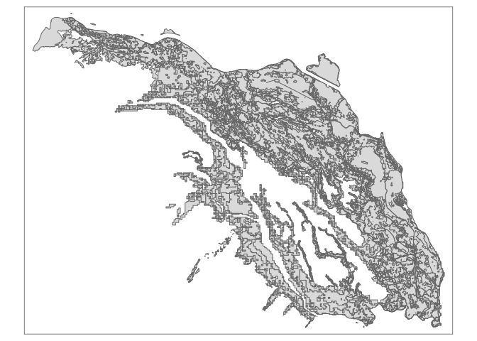

l11-12
================

    ## Warning: package 'purrr' was built under R version 4.0.5

``` r
#japn_roads = st_read("~/class/data/JPN_rds/JPN_roads.shp")
japn_hazzard = st_read("~/class/data/A31-12_11_GML/A31-12_11.shp")
```

    ## Reading layer `A31-12_11' from data source `/home/rstudio/class/data/A31-12_11_GML/A31-12_11.shp' using driver `ESRI Shapefile'
    ## Simple feature collection with 9020 features and 6 fields
    ## Geometry type: POLYGON
    ## Dimension:     XY
    ## Bounding box:  xmin: 139.0879 ymin: 35.78001 xmax: 139.8967 ymax: 36.27891
    ## Geodetic CRS:  JGD2000

``` r
#japn_msk_pop = raster("~/class/data/JPN_msk_pop/jpn_msk_pop.vrt")


#tm_shape(japn_msk_pop) +
#   tm_raster() +
tm_shape(japn_hazzard) +
  tm_polygons()
```

<!-- -->
